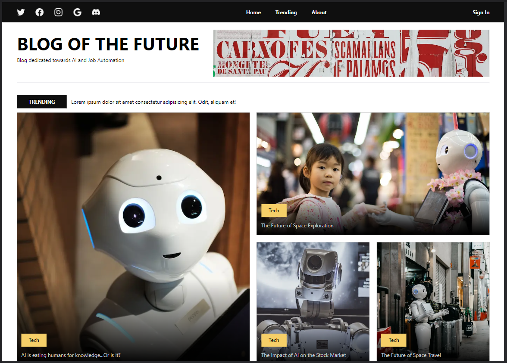
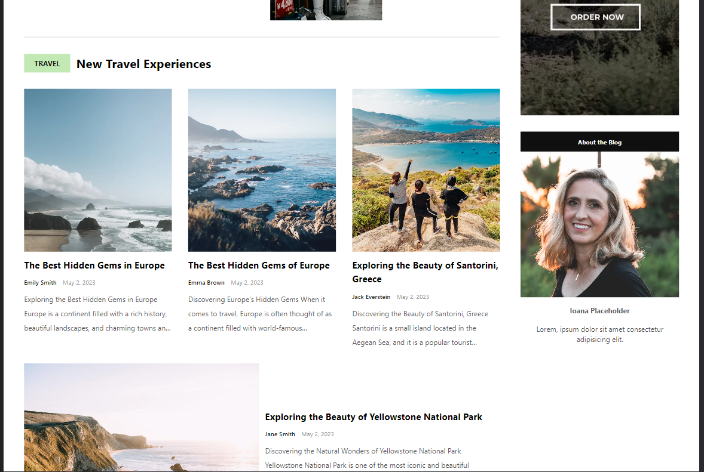
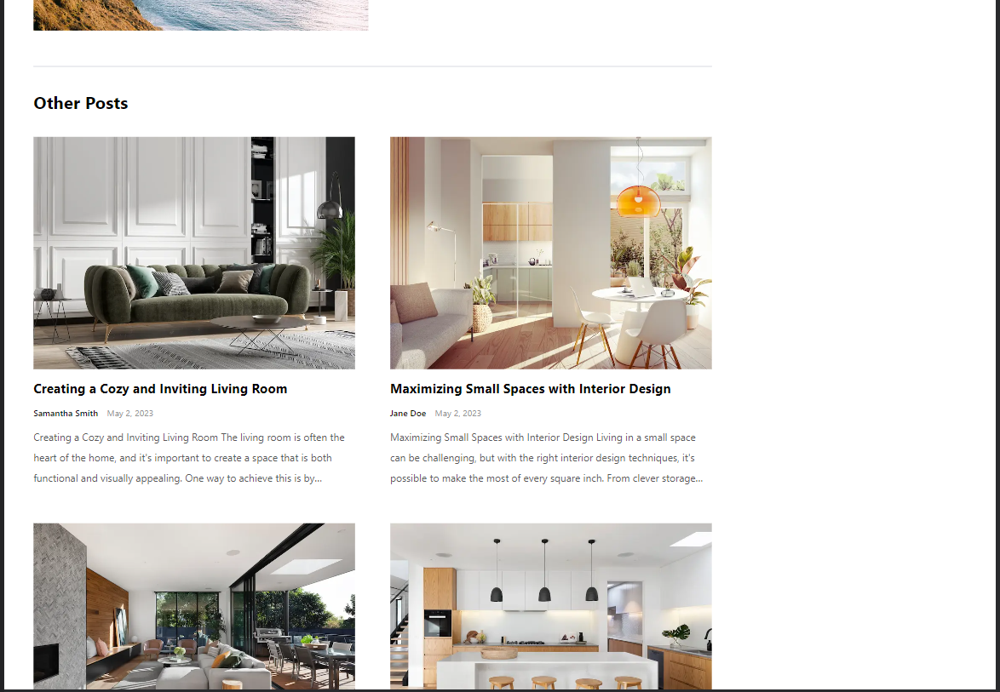
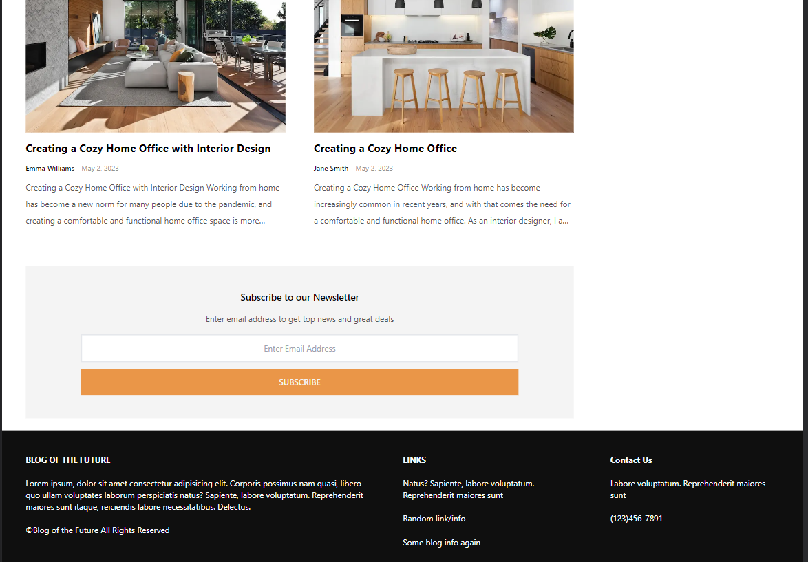
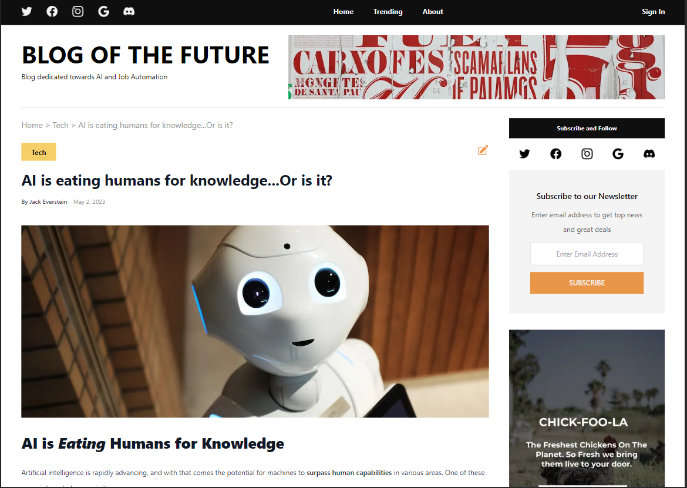
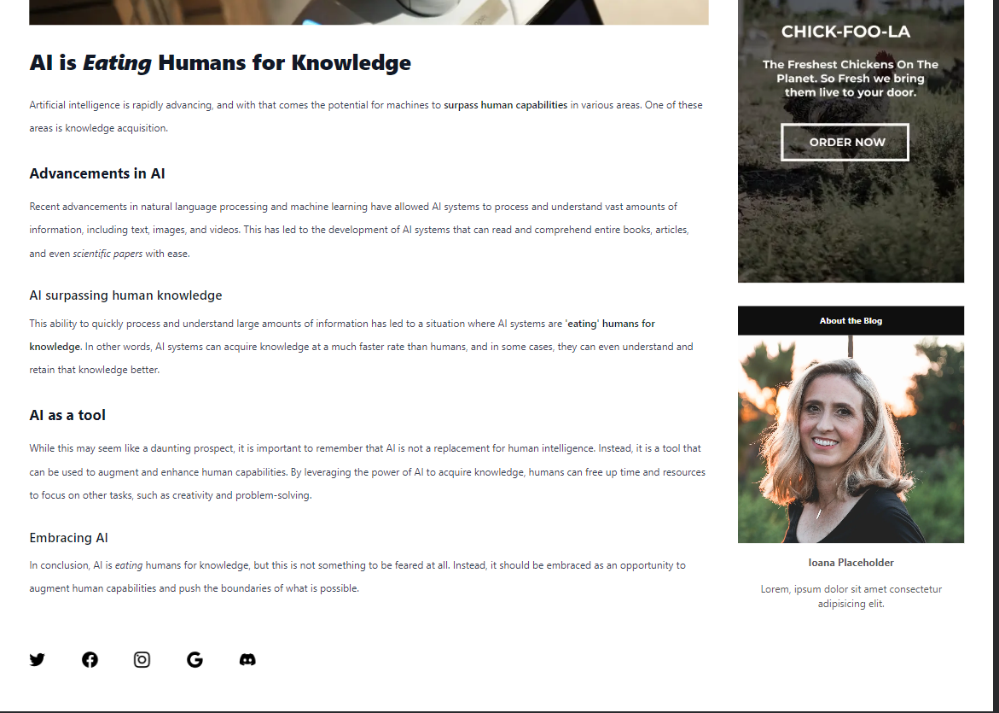
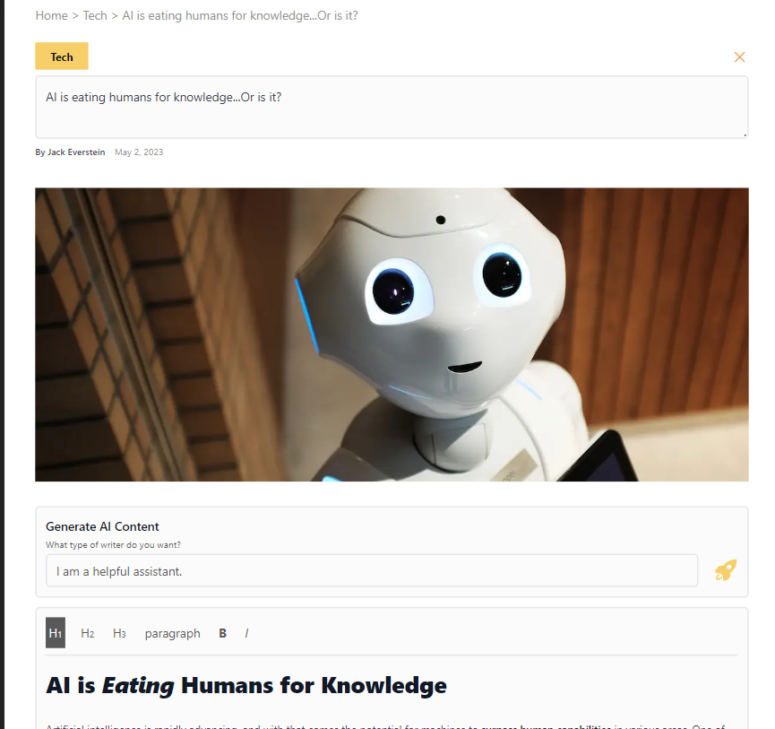
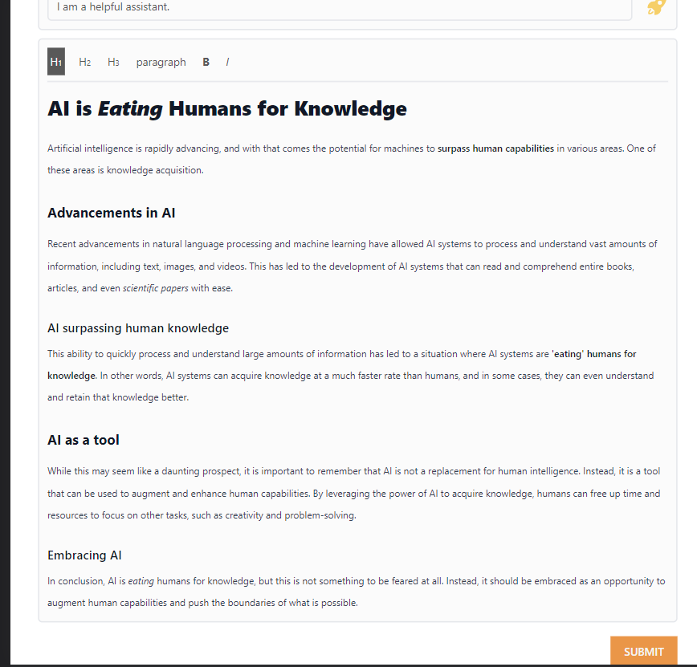
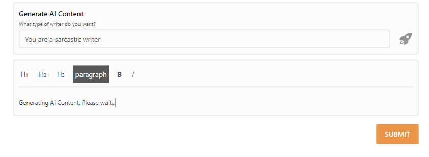
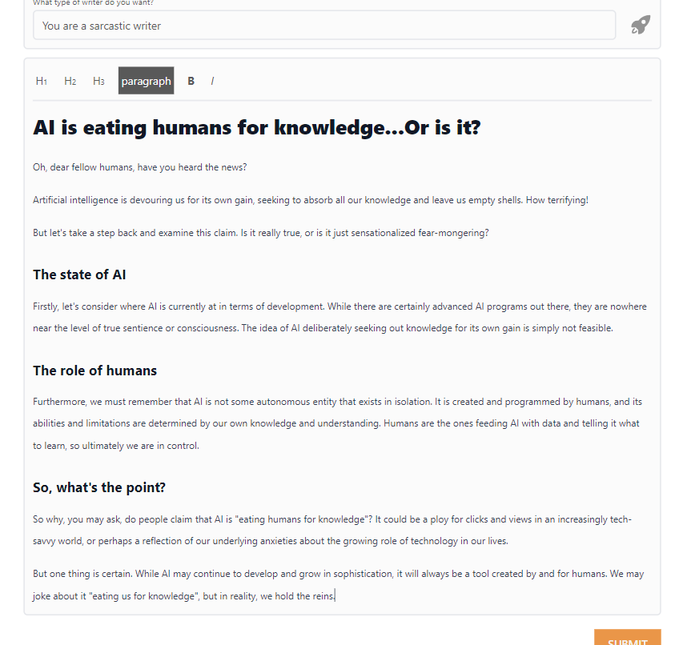

## AI Blog App

A full-stack NEXT.js 13 application with TypeScript presenting blog posts that can also be generated with OpenAI(ChatGPT).

Complex responsive layout that showcases the posts made by users.

Each posts has a unique page and the owner can edit or generate new content on demand.

Other technologies/libraries used:

- Tailwind CSS for application design
- OpenAi for post data generation
- Prisma ORM with MySQL database from PlantScale
- Tip-tap text editor for posts

### App presentation

#### Home page

##### Trending Posts section

The navbar + social media and the main header of the blog having ad space next to it.  
The first section of the home page - the trending posts with small description.

##### Hot Posts section

Hot posts section with newsletter and social media next to it and an ad space under.

##### Travel Posts section

Travel posts section with continuation of the ad space and information about the blog owner.

##### Other Posts section

Posts section with other categories.

##### Footer

Continuation of other posts category and the footer of the page.

#### Single Post page

Breadcrumbs navigation display and post title with edit button next to it and information about the author and time.

Post content and social media of the author at the end.

#### Editing Post

After pressing the edit button the author can change the title of the post.
Then, they can generate new content with the AI Bot based on the new title by also completing what role (or keep the default role) they want the generated content to be based on (example: A sarcastic writer).

Post content before the AI generation.  
The content can also just be edited without generating new one with the AI Bot.

Post content while the AI Bot is generating content.

New post content that has just been generated to be edited if needed.  
The new content is generated with HTML tags.

### What I learned?

In this project my goal was learning some of the NEXT.js 13's features, from the new app directory to server and client components and how the project should be structured.

How to implement and use Prisma ORM with MySQL database that is hosted on PlanetScale - connecting to remote db, schema and data seeding.

How to make a responsive design using Tailwind CSS in a NEXT project.

How to use Tip-tap text editor, generate, store and edit data.

How to deploy to Vercel and limitation of free plan.

### How to run?

Next App

> npm run build
